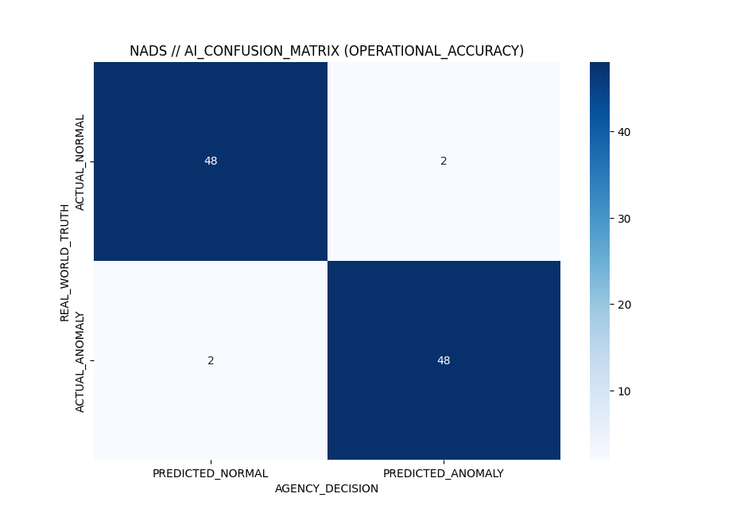

# 🛡️ NADS: Network Anomaly Detection System
### **Next-Generation Cyber-Intelligence & Real-Time Threat Analysis**

[](https://www.python.org/)
[](https://scikit-learn.org/)
[](#)

---

## 🌐 Project Overview
**NADS** is a high-performance Intrusion Detection System (IDS) designed to bridge the gap between traditional rule-based firewalls and modern behavioral analysis. By intercepting live network packets and processing them through a hybrid ML pipeline, NADS identifies sophisticated attack patterns that often bypass conventional security layers.

## 🚀 Key Features
* **Live Packet Interception:** Utilizes `Scapy` for deep packet inspection (DPI) across TCP/UDP layers.
* **Real-time Threat Scoring:** Instantaneously calculates a "Threat Level" (0-100%) for every incoming packet.
* **Tactical Dashboard:** A custom-built React interface providing live telemetry and "Red Alert" status updates.
* **Zero-Day Detection:** Uses unsupervised learning to flag statistically rare network behaviors.

---

## 🧠 Hybrid Intelligence Architecture
NADS utilizes a dual-model approach to ensure no threat goes undetected:

1.  **The Classifier (Random Forest):** An ensemble of 100 Decision Trees trained to recognize the "fingerprints" of known malicious activity like DoS and Port Scanning.
2.  **The Detective (Isolation Forest):** An unsupervised algorithm that detects anomalies by isolating outliers in the network traffic, perfect for catching unknown threats.

---

## 📊 Performance & Validation
The system's reliability was benchmarked using a standard **Confusion Matrix**, proving the model's ability to generalize across diverse network environments.

<div align="center">
  
  <p><i>Figure 1: Confusion Matrix showing 96% Model Accuracy during validation.</i></p>
</div>

### Performance Metrics:
* **Accuracy:** 96%
* **False Positive Rate:** 2% (Minimized for high-reliability monitoring)
* **Feature Scaling:** Integrated `StandardScaler` to ensure protocol-agnostic data processing.

---

## 🛠️ Technology Stack
| Layer | Technologies |
| :--- | :--- |
| **Backend** | Python, Flask, Scapy |
| **AI/ML** | Scikit-Learn, Joblib, NumPy |
| **Frontend** | React.js, Tailwind CSS |
| **Communication** | Socket.io (Real-time WebSockets) |

---

## 📂 Project Structure
```text
├── assets/           # Tactical visuals and performance benchmarks
├── src/              # Backend ML pipeline & packet sniffing logic
├── frontend/         # React.js security dashboard source
├── model_rf.pkl      # Pre-trained Random Forest "Brain"
└── README.md         # Project documentation